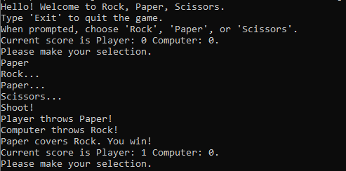

# rock_paper_scissors
Simple Python program that plays Rock, Paper, Scissors with you. Run the program and follow the onscreen prompts to play. The computer randomly picks what to throw, and a running score is kept. To play, clone the repo. Then, navigate to the folder in your command prompt and run the program using Python. 

